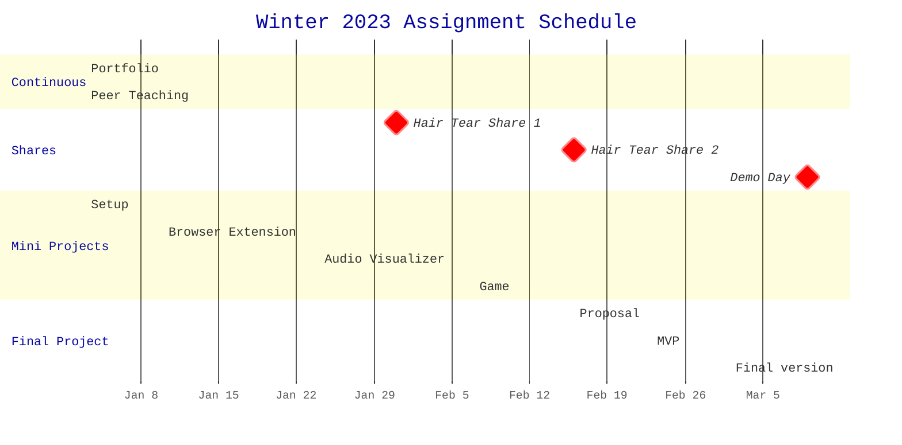

Welcome to Web Technologies! This is the central repository for the course
content, which is organized as follows:

- `activities/` contains instructions for in-class activities
- `assignments/` contains instructions for each course assignment
- `resources/` contains lists of resources for your reference
- `slides/` contains PDF versions of slides used in class

Please also see [the syllabus](/syllabus.md) for a course overview.

## Coursework

This is a project-based course. There is no "one true way" to learn about web
technologies. Instead of problem sets and quizzes in which their work will be
lost to time, students will "just build websites"[^justbuildwebsites]. We will
begin by setting up a portfolio website, which will grow over the quarter to
document projects done for the course. As a result, any work done for this
course will be publicly visible. Coursework comprises mini projects, a final
project, and development reflections ("hair tear shares").

## Weekly Schedule

<h3>Week 1: Intro and HTML/CSS</h3>

#### 1.1 January 3: Welcome and Environment Setup

- Assignments
  - Assigned: [MP0: Portfolio site setup](assignments/mp0_setup.md)
- In class
  - [slides](slides/1.1.pdf)
  - Welcome and course overview
  - Intro survey (link on Canvas)
  - Join the Discord (link on Canvas)
  - Work Time: [Environment setup activity](activities/01_environment_setup.md)
- After class
  - Get your environments set up and work on MP0

#### 1.2 January 5: HTML/CSS Intro

- In class
  - [slides](slides/1.2.pdf)
  - Demo: Git review: cloning a repo, editing content, pushing changes
  - Demo: MP0 Walkthrough
  - Demo: HTML/CSS
  - Work Time: MP0
- After class
  - Continue working on MP0

<h3>Week 2: The DOM, Javascript, and Web Extensions</h3>

#### 2.1 January 10: Javascript Intro

- Assignments
  - Due: MP0
  - Assigned: [MP1: Browser Extension](/assignments/mp1_extension.md)
- In-class
  - [slides](slides/2.1.pdf)
  - Share MP0
  - JavaScript Intro
  - Intro to the DOM - Codepen Live demos:
    - [Creating and adding elements](https://codepen.io/branchwelder/pen/oNMZbrG)
    - [Adding different kinds of event listeners](https://codepen.io/branchwelder/pen/abjJNmw)
    - [Querying the DOM and randomizing colors](https://codepen.io/branchwelder/pen/vYayyOP)
  - Work time: [JS and the DOM activity](/activities/02_js_and_the_dom.md)
- After class
  - Continue working on the activity, start MP1 if you would like

#### 2.2 January 12

- In-class
  - [slides](slides/2.2.pdf)
  - Intro to browser extensions
  - Demo: MP1 walkthrough
  - Brainstorm MP1 ideas
  - Work time: MP1
- After class
  - Work on MP1

<h3>Week 3: JavaScript Part Two</h3>

#### 3.1 January 17

- In-class
  - [slides](slides/3.1.pdf)
  - More on functions in JavaScript
  - Demo example: Message passing
  - Activity: Make extension work groups
  - Work time
- After class
  - Work on MP1

#### 3.2 January 19

- In-class
  - [slides](slides/3.2_async.pdf)
  - Check-in [survey](https://forms.gle/4P5cVzejdHEeiNco6)
  - How to turn in MP1
  - Scope and async/await
  - Async walkthrough demo
  - Work time!
- After class
  - Work on MP1

<h3>Week 4: Browser APIs</h3>

#### 4.1 January 24

- Assignments
  - Due: MP1
  - Assigned: MP2
- In-class
  - Share: MP1
  - Review JavaScript objects
  - Intro to Browser APIS
  - Work time: Begin MP2: Audio Visualizer

#### 4.2 January 26

- Lecture
  - SVG
- In-class
  - Continue MP2: Audio Visualizer

<h3>Week 5: Libraries and Frameworks</h3>

#### 5.1 January 31

- Lecture
  - Web Components: htmlElement, React, and Lit
- In-class
  - Continue MP2: Audio Visualizer

#### 5.2 February 2

- Lecture
- In-class
  - Continue MP2: Audio Visualizer

<h3>Week 6: Games and Interactivity</h3>

#### 6.1 February 7

- Due
  - MP2 - Audio Visualizer
- Lecture
- In-class
  - Share-back: MP2: Audio Visualizer
  - Begin MP3: Game

#### 6.2 February 9

- In-class
  - Continue MP3: Game

<h3>Week 7: Mobile</h3>

#### 7.1 February 14 _NO CLASS - HANNAH TRAVELING_

- Outside class
  - Continue MP3: Game

#### 7.2 February 16

- Lecture
- In-class
  - Continue MP3: Game

<h3>Week 8: The Full Stack</h3>

#### 8.1 February 21

- Due
  - MP3 - Game
- Lecture
  - Planning your projects
- In-class
  - MP3 Share

#### 8.2 February 23

- **DUE: FP0 - Final Project Proposal**
- Lecture
  - TBD
- In-class
  - FP0 Share
  - Project work time

<h3>Week 9: Special Topics, Project Iteration</h3>

#### 9.1 February 28

- Lecture
  - TBD
- In-class
  - Project work time

#### 9.2 March 2

- **DUE: FP1 - MVP**
- Lecture
  - TBD
- In-class
  - Project work time

<h3>Week 10: Project wrap-up and Demos!</h3>

#### 10.1 March 7

- Lecture
  - TBD
- In-class
  - Project work time

#### 10.2 March 9

- Lecture
  - Wrap-up, looking forward
- In-class
  - Final Projects demo day and fun!

<h3>Week 11: Finals Week</h3>

#### March 17

- **DUE: FP2: Final Project**
- **DUE: Final Portfolio**

[^justbuildwebsites]: http://justbuildwebsites.com/
