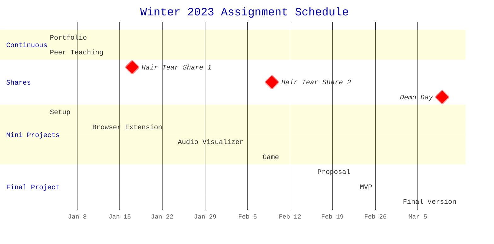

Welcome to Web Technologies! This is the central repository for the course
content, which is organized as follows:

- `class/` contains descriptions of in-class assignments for each class session
- `projects/` contains folders with instructions and starter code for each
  project you will do in the course
- `resources/` contains lists of resources for your reference

Please also see [the syllabus](/syllabus.md) for a course overview.

---

## Coursework

This is a project-based course. Students will document their work on a public
portfolio website throughout the quarter. Any technical work completed for this
course should be publicly available. Coursework comprises mini projects, a final
project, and development reflections ("hair tear shares").

## Weekly Schedule

<h3>Week 1: Intro and HTML/CSS</h3>

#### 1.1 January 3: Welcome and Environment Setup

<!-- TODO: Link slides -->

- Lecture
  - Welcome and course overview
- In-class
  - Activity: [Environment setup](class/01_intro.md)
- Assigned work
  - [MP0: Portfolio site](projects/mp0_portfolio/README.md)

#### 1.2 January 5: HTML/CSS Intro

<!-- TODO: Link slides -->

- Lecture
  - Git review
  - MP0 example walkthrough
  - HTML/CSS, live demo
- In-class
  - Continue working on [MP0: Portfolio](projects/mp0_portfolio/README.md)

<h3>Week 2: The DOM, Javascript, and Web Extensions</h3>

#### 2.1 January 10: Javascript Intro

- Due
  - MP0
- Lecture
  - JavaScript Intro
- In-class
  - MP0 share
  - Activity: Adding interaction to your portfolio with JavaScript
  - Begin MP1: Browser Extension

#### 2.2 January 12

- Lecture
  - Web Extensions overview, MP1 walkthrough
- In-class
  - Continue MP1: Browser Extension

<h3>Week 3: Development Tools and Strategies</h3>

#### 3.1 January 17

- Due
  - Hair Tear Share #1
- Lecture
- In-class
  - Hair Tear Shares
  - Continue MP1: Browser Extension

#### 3.2 January 19

- Lecture
- In-class
  - Continue MP1: Browser Extension

<h3>Week 4: Browser APIs</h3>

### Week 4

#### 4.1 January 24

- Due
  - MP1 - Browser Extension
- Lecture
  - Intro to Browser APIS
- In-class
  - MP1 Share
  - Begin MP2: Audio Visualizer

#### 4.2 January 26

- Lecture
- In-class
  - Continue MP2: Audio Visualizer

<h3>Week 5: Libraries and Frameworks</h3>

### Week 5

#### 5.1 January 31

- Lecture
- In-class
  - Continue MP2: Audio Visualizer

#### 5.2 February 2

- Lecture
- In-class
  - Continue MP2: Audio Visualizer

<h3>Week 6: Games and Interactivity</h3>

#### 6.1 February 7

- Due
  - MP2 - Audio Visualizer
- Lecture
- In-class
  - Share-back: MP2: Audio Visualizer
  - Begin MP3: Game

#### 6.2 February 9

- Due
  - Hair Tear Share #2
- Lecture
- In-class
  - Hair Tear Shares
  - Continue MP3: Game

<h3>Week 7: Mobile</h3>

#### 7.1 February 14 _NO CLASS - HANNAH TRAVELING_

- Outside class
  - Continue MP3: Game

#### 7.2 February 16

- Lecture
- In-class
  - Continue MP3: Game

<h3>Week 8: The Full Stack</h3>

#### 8.1 February 21

- Due
  - MP3 - Game
- Lecture
  - Planning your projects
- In-class
  - MP3 Share

#### 8.2 February 23

- **DUE: FP0 - Final Project Proposal**
- Lecture
  - TBD
- In-class
  - FP0 Share
  - Project work time

<h3>Week 9: Special Topics, Project Iteration</h3>

#### 9.1 February 28

- Lecture
  - TBD
- In-class
  - Project work time

#### 9.2 March 2

- **DUE: FP1 - MVP**
- Lecture
  - TBD
- In-class
  - Project work time

<h3>Week 10: Project wrap-up and Demos!</h3>

#### 10.1 March 7

- Lecture
  - TBD
- In-class
  - Project work time

#### 10.2 March 9

- Lecture
  - Wrap-up, looking forward
- In-class
  - Final Projects demo day and fun!

<h3>Week 11: Finals Week</h3>

#### March 17

- **DUE: FP2: Final Project**
- **DUE: Final Portfolio**

