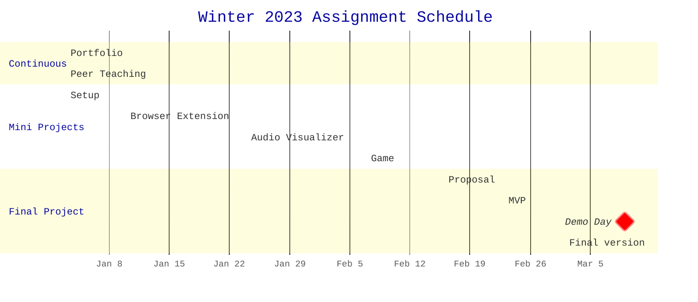

Welcome to Web Technologies! This is the central repository for the course
content, which is organized as follows:

- `activities/` contains instructions for in-class activities
- `assignments/` contains instructions for each course assignment
- `resources/` contains lists of resources for your reference
- `slides/` contains PDF versions of slides used in class

If you are a student in HCDE 438, please also see the syllabus (on Canvas) for a
course overview.

## Coursework

This is a project-based course. There is no "one true way" to learn about web
technologies. Instead of problem sets and quizzes in which their work will be
lost to time, students will "just build websites"[^justbuildwebsites]. We will
begin by setting up a portfolio website, which will grow over the quarter to
document projects done for the course. As a result, any work done for this
course will be publicly visible. By the end of the course, students will have
produced a browser extension, an audio visualizer, a game, and a final project,
all of which will be included in their final portfolio submission.

## Weekly Schedule

<h3>Week 1: Intro and HTML/CSS</h3>

#### 1.1 January 3: Welcome and Environment Setup

- Assignments
  - Assigned: [MP0: Portfolio site setup](assignments/mp0_setup.md)
- In class
  - [slides](slides/1.1.pdf)
  - Welcome and course overview
  - Intro survey (link on Canvas)
  - Join the Discord (link on Canvas)
  - Work Time: [Environment setup activity](activities/01_environment_setup.md)
- After class
  - Get your environments set up and work on MP0

#### 1.2 January 5: HTML/CSS Intro

- In class
  - [slides](slides/1.2.pdf)
  - Demo: Git review: cloning a repo, editing content, pushing changes
  - Demo: MP0 Walkthrough
  - Demo: HTML/CSS
  - Work Time: MP0
- After class
  - Continue working on MP0

<h3>Week 2: The DOM, Javascript, and Web Extensions</h3>

#### 2.1 January 10: Javascript Intro

- Assignments
  - Due: MP0
  - Assigned: [MP1: Browser Extension](/assignments/mp1_extension.md)
- In-class
  - [slides](slides/2.1.pdf)
  - Share MP0
  - JavaScript Intro
  - Intro to the DOM - Codepen Live demos:
    - [Creating and adding elements](https://codepen.io/branchwelder/pen/oNMZbrG)
    - [Adding different kinds of event listeners](https://codepen.io/branchwelder/pen/abjJNmw)
    - [Querying the DOM and randomizing colors](https://codepen.io/branchwelder/pen/vYayyOP)
  - Work time: [JS and the DOM activity](/activities/02_js_and_the_dom.md)
- After class
  - Continue working on the activity, start MP1 if you would like

#### 2.2 January 12 Browser Extensions

- In-class
  - [slides](slides/2.2.pdf)
  - Intro to browser extensions
  - Demo: MP1 walkthrough
  - Brainstorm MP1 ideas
  - Work time: MP1
- After class
  - Work on MP1

<h3>Week 3: JavaScript Part Two</h3>

#### 3.1 January 17 Functions

- In-class
  - [slides](slides/3.1.pdf)
  - More on functions in JavaScript
  - Demo example: Message passing
  - Activity: Make extension work groups
  - Work time
- After class
  - Work on MP1

#### 3.2 January 19 Async/Await

- In-class
  - [slides](slides/3.2_async.pdf)
  - Check-in [survey](https://forms.gle/4P5cVzejdHEeiNco6)
  - How to turn in MP1
  - Scope and async/await
  - Async walkthrough demo
  - Work time!
- After class
  - Work on MP1

<h3>Week 4: P5 intro and CSS Layouts</h3>

#### 4.1 January 24 P5 Intro

- Assignments
  - Due: MP1
  - Assigned: MP2
- In-class
  - [slides](slides/4.1_p5.pdf)
  - Share back MP1!
  - Break
  - Introducing MP2 - Creative code!
  - Work time - get started on MP2

#### 4.2 January 26 CSS Layouts

- In-class
  - [slides](slides/4.2_flex_and_grid.pdf)
  - CSS Flex and Grid
  - Example walkthroughs
  - Break
  - Work time: [CSS Layouts](activities/03_css_layouts.md) for building your MP2
    gallery page!
- After class
  - Keep working on MP2

<h3>Week 5: Templates and Components</h3>

#### 5.1 January 31 Portfolio Accessibility

- In-class
  - [slides](slides/5.1_portfolio_accessibility.pdf)
  - Announcements
  - Final Portfolio and accessibility
  - Work time: Consider current portfolio accessibility
  - Work time: Continue MP2

#### 5.2 February 2 Web Components

- In-class
  - Templating with `lit-html`
  - Demo
  - Activity: Templates
  - Web components
  - Work time: Continue MP2

<h3>Week 6: Games!</h3>

#### 6.1 February 7 Objects Review

- Due
  - MP2
- In-class
  - Share-back: MP2: Audio Visualizer
  - MP3 brainstorming
  - Activity: Objects review
  - Begin MP3: Game

#### 6.2 February 9 Managing state

- In-class
  - Managing state
  - Continue MP3: Game

<h3>Week 7: Libraries</h3>

#### 7.1 February 14 _NO CLASS - HANNAH TRAVELING_

- Outside class
  - Continue MP3: Game

#### 7.2 February 16

- In-class
  - Continue MP3: Game

<h3>Week 8: The Full Stack</h3>

#### 8.1 February 21

- Due
  - MP3 - Game!
- In-class
  - MP3 Share
  - Final Project Brainstorming
  - Planning your projects

#### 8.2 February 23

- **DUE: FP0 - Final Project Proposal**
- In-class
  - FP0 Share
  - TBD Special topics
  - Project work time

<h3>Week 9: Special Topics, Project Iteration</h3>

#### 9.1 February 28

- In-class
  - TBD special topics
  - Project work time

#### 9.2 March 2

- **DUE: FP1 - MVP**
- In-class
  - Project work time

<h3>Week 10: Project wrap-up and Demos!</h3>

#### 10.1 March 7 Work time!

- In-class
  - Project work time

#### 10.2 March 9 Demo day!

- In-class
  - Wrap-up, looking forward
  - Final Projects demo day and fun!

<h3>Week 11: Finals Week</h3>

#### March 17

- **DUE: FP2: Final Project**
- **DUE: Final Portfolio**

[^justbuildwebsites]: http://justbuildwebsites.com/
